#### Overview

An agentic pipeline that searches, curates, and thematically pairs Opinion and Case Study articles on any research topic. The research topic is completely configurable. Incorporates the construct of a human-in-the-loop to check the search findings before the matching between the Opinion articles and the Case Study articles is finalised.

#### Why This Exists

I write a Substack series, Structure & Sense, on operating-model design and transformation leadership. It runs on a steady stream of curated external research, and for a while I did that curation manually: searching, reading, judging relevance, spotting thematic links between opinion pieces and real case studies. I was spending at least 2 complete days on it. This clearly wasn't scalable in the long run. There were some weeks where the research was compromised due to other activities that also demanded time. I decided to try to implement this as a one-touch agentic system where the only manual activity was to quality check the output that the agentic system generated. 

The system that I've created handles both search and curation but as 2 different workflows with the second one getting triggered after I've reviewed the search results. The system uses multiple tools and providers to avoid vendor lock-in, follows a human-in-the-loop design, and runs automatically on a configurable schedule.

#### Architecture

```mermaid
flowchart TD
    START1([GitHub Actions: Weekly Cron<br/>node run1-search-curate.js])--> CFG[Load config profile<br/>keywords, prompts, thresholds, provider choices]
    CFG --> VAULT[Load Obsidian vault file<br/>if present]
    VAULT --> DEDUP[Build dedup seen-URL set<br/>from headings within lookback window]

    DEDUP --> PAR1{{parallel}}

    subgraph SEARCH[" STAGE 1 — SEARCH (parallel across lanes) "]
        direction LR
        SO[Search: Opinion lane<br/>Tavily / Exa / Claude web_search]
        SC[Search: Case Study lane<br/>Tavily / Exa / Claude web_search]
    end

    PAR1 --> SO
    PAR1 --> SC

    SO --> DF1[Dedup filter<br/>drop already-seen URLs]
    SC --> DF2[Dedup filter<br/>drop already-seen URLs]

    DF1 --> PAR2{{parallel}}
    DF2 --> PAR2

    subgraph CURATE[" STAGE 2 — CURATE (parallel across lanes, batched + throttled within each) "]
        direction LR
        subgraph CO[Curator: Opinion lane]
            direction TB
            CO1[Batch 1] --> CO2[Batch 2] --> CO3[Batch N<br/><i>sequential — respects<br/>per-provider TPM/RPM pacing</i>]
        end
        subgraph CC[Curator: Case Study lane]
            direction TB
            CC1[Batch 1] --> CC2[Batch 2] --> CC3[Batch N<br/><i>sequential — respects<br/>per-provider TPM/RPM pacing</i>]
        end
    end

    PAR2 --> CO1
    PAR2 --> CC1

    CO3 --> HARD1[Optional hard age-limit<br/>backstop filter]
    CC3 --> HARD2[Optional hard age-limit<br/>backstop filter]

    HARD1 --> INC1[Opinion: Include / Flag / Exclude]
    HARD2 --> INC2[Case Study: Include / Flag / Exclude]

    INC1 --> ISSUE
    INC2 --> ISSUE

    ISSUE[["Open GitHub Issue<br/>Include/Flag articles as a checklist<br/>Excluded articles dropped, count noted<br/>labelled pending-review"]]

    ISSUE --> HUMAN{{"HUMAN REVIEW<br/>check / uncheck boxes,<br/>overriding curator where needed"}}

    HUMAN -->|"close Issue"| TRIGGER([GitHub Actions: issues closed<br/>node run2-match-table.js])

    TRIGGER --> RECOVER[Read closed Issue<br/>recover article data + final<br/>checkbox decisions from Issue body]

    RECOVER --> MATCH

    MATCH[" STAGE 3 — MATCH (serial — needs both lanes' final Included sets)<br/>propose loose thematic pairings, one-to-one "]

    MATCH --> VALIDATE[Validate every proposed pairing<br/>actually belongs to both Include sets<br/>— drop and log anything that doesn't]

    VALIDATE --> TABLES[" STAGE 4 — TABLE GENERATION (deterministic, no LLM)<br/>Matched Pairs / Opinion Unmatched / Case Study Unmatched "]

    TABLES --> COMMENT[Post draft as a comment<br/>on the same Issue]

    COMMENT --> PROMOTE([Manual: review draft, then<br/>promote into Obsidian vault<br/>— vault is never written to automatically])

    style SEARCH fill:#eef6ff,stroke:#4a90d9
    style CURATE fill:#fff7e6,stroke:#d9a44a
    style ISSUE fill:#fff0f0,stroke:#d94a4a
    style HUMAN fill:#fff0f0,stroke:#d94a4a
    style MATCH fill:#f3eefc,stroke:#8a5fd6
    style TABLES fill:#eafaf0,stroke:#4ac97a

```



This agentic system has two workflows: Run 1 and Run 2 where Run 2 gets triggered after a human review. 

**Run 1: Search & Curate** (`run1-search-curate.js`) runs weekly via GitHub Actions. It runs two lanes in parallel: The Opinion Lane and The Case Study Lane, against configurable keywords. Since this runs on a weekly basis there's a chance of the search finding articles that came up during a historical run. To ensure that new searches always bring up new articles the system also runs a check against articles already saved in my Obsidian vault. The Curator then scores each article per the criteria defined and presents the list of articles to the Human reviewer categorised as: Include, Flag, or Exclude, with a reason. The output is posted as a checklist on a new GitHub Issue, labelled `pending-review`.

The **Human review** happens on that Issue. I check or uncheck boxes, overriding the curator where I disagree, and close the Issue when done.

**Run 2: Match & Draft** (`run2-match-table.js`) triggers on Issue close. It reads my final decisions from checkbox state, proposes thematic pairings between included articles, generates the digest tables, and posts the draft as a comment on the same Issue. To prevent accidental overwriting of content, I promote it into my vault myself.

#### Design Decisions

**Provider-agnostic by design:** Nothing topic-specific has been hardcoded. Every LLM and search call passes through a single router and every topic lives in its own config file. To extend this to a new research topic requires only a new config file to be created without any changes required to the code.

**Human-in-the-loop through GitHub Issues, not a custom interface:** The system posts the search content to a GitHub Issue, the same interface used for the human review. This is a known pattern from GitOps. Ticking the checkbox and closing the issue has been designed to trigger the Match and Draft workflow, following the same GitOps pattern. I considered a custom review page and decided the project didn't need one yet.

**Tuned for what each provider's free tier actually limits:** Each provider caps requests in different ways - Gemini caps requests per day, which favours fewer, larger batches. Groq caps tokens per minute, which favours the opposite. This system could have been optimised for one provider but I decided to incorporate flexibility by tuning the batch design to each one separately.

#### Current Status

Portions that have been tested as working: 
- Gemini for reasoning
- Tavily for search 
- De-duplication against historical searches (saved within my own vault)
- The full system end-to-end including the human review

Built (but not tested live): 
- Anthropic (instead of Gemini) for reasoning
- Exa (instead of Tavily) for search.

#### What I'd Change in Version 2

1. **Fuzzy De-duplication of URLs**: The current de-duplication catches an exact URL, not the same story republished elsewhere with a slightly different URL. A fuzzy match would close part of that issue, though not all of it, and would still improve output quality.

2. **Custom Review Page:** GitHub Issues work at the volume I've set - but may not work at scale for larger volumes. A review page would be something that will need to be created.

3. **Run History Documentation:** Right now understanding a run requires reading through the log files and this is a limiting way to continually improve the system. Proper documentation of run history including what failed, what ran and what ran well, will help feed the improvements back into the system.

#### Setup

```bash
npm install
cp .env.example .env   # fill in the provider keys you plan to use
```

**Run search & curate:**
```bash
node run1-search-curate.js <profile-name>
```
Requires `GITHUB_TOKEN` and `GITHUB_REPO` (format: `owner/repo`) as environment variables, plus whichever provider keys your config profile uses.

**Run match & draft**, after closing the review Issue:
```bash
GITHUB_ISSUE_NUMBER=<issue-number> node run2-match-table.js
```

In production, both steps run automatically via the included GitHub Actions workflows (`.github/workflows/run1-weekly.yml` on a weekly cron, `.github/workflows/run2-on-approval.yml` on Issue close), with provider keys stored as repository secrets.

---

*Structure and Sense is for transformation leaders and architects: how organisations are designed, how they fail, and what it takes to build them better.*